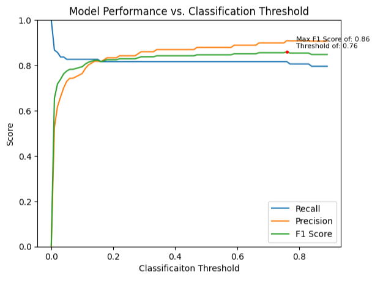
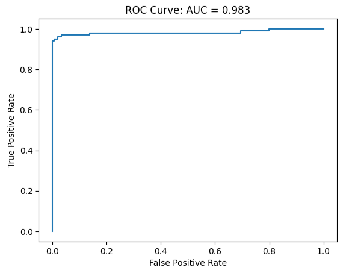
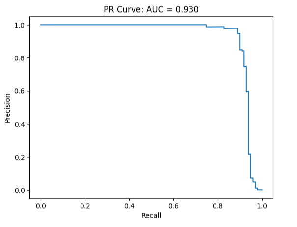
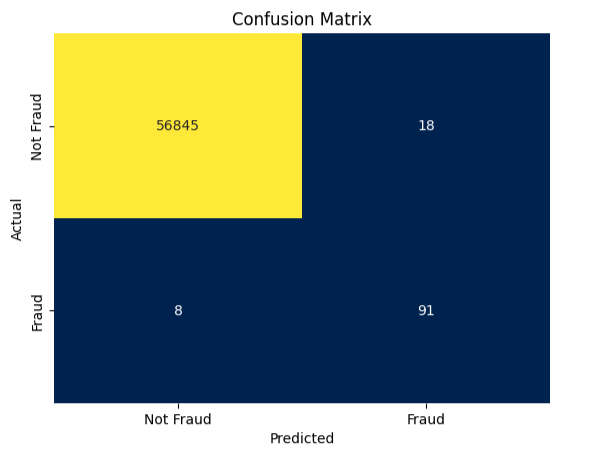
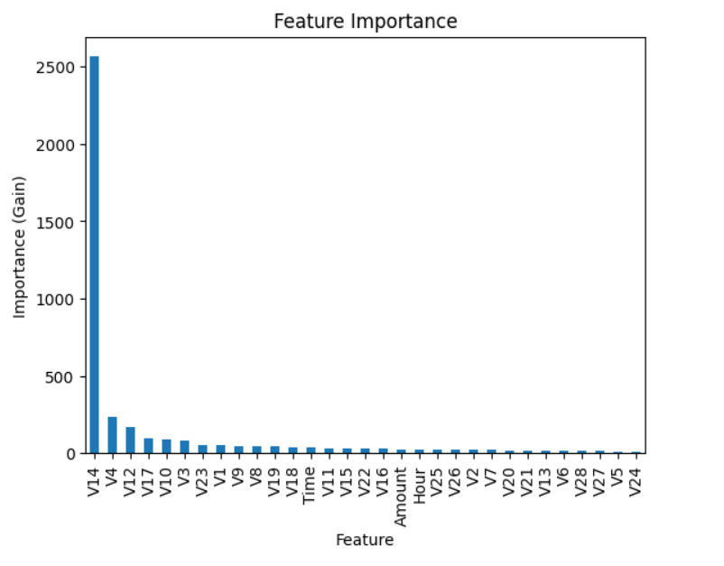

# Credit Card Fraud Detection

## Table of Contents
- [Project Overview](#project-overview)
- [Comparison Process](#comparison-process)
- [Requirements](#requirements)
- [How to Run](#how-to-run)
- [Model Performance and Visuals](#model-performance-and-visuals)


## Project Overview
The purpose of this project is to compare how different resampling methods affect the performance of a machine learning model used to identify fraudulent credit card transactions. The dataset contains real anonomized transactions, so it is naturally imbalanced; only 0.17% of the samples are fraud. Three different resampling methods are compared here: 
1. Synthetic Minority Oversampling Technique (SMOTE): SMOTE generates synthetic samples of fraudulent transactions by interpolating between existing fraudulent samples in the dataset. 
2. Undersampling: Randomly removes non-fraudulent samples to create a more balanced dataset.
3. Cost-sensitive learning: Does not change the data but assigns a higher penalty for mislabeling fraudulent samples.

A baseline model with no resampling method is also included for comparison. XGBoost is the model of choice due to its strong performance on imbalanced tabular datasets. 

## Comparison Process
1. Tune each model's hyperparameters using the training data
2. Tune each model's probability threshold for identifying a transaction as fraud using the validation data and the optimal hyperparameters, i.e. if the threshold is 0.6 then the model labels a transaction as fraud if it calculates the probability of that transaction being fraud as 0.6 or higher.
3. Test each model on the test data

## Requirements

- Python 3.x  
- Jupyter Notebook / JupyterLab

## How to Run

1. **Clone this repository**
    ```bash
    git clone https://github.com/coopergau/fraud-detection
    cd fraud-detection
    ```

1. **Install dependencies**
    ```bash
    pip install -r requirements.txt
    ```

2. **Launch Jupyter Notebook**
    ```bash
    jupyter notebook
    ```

3. **Open the main notebook**
    Navigate to fraud_detection.ipynb and run all cells (Run > Run All Cells).

> **Notice:** Hyperparameter tuning may take ~1 hour.  
> To skip this step and use the already selected hyperparameters run all the cells before the one beginning with "# Create and evaluate the models" and then run all the cells after that same cell.
> This can be done by going to the cell "# Create and evaluate the models" and selecting (Run > Run All Above Selected Cell) and then going to the next cell and selecting (Run > Run Selected Cell and All Below).

## Model Performance and Visuals
Three metrics are used to evaluate model performance:
1. Precision - The proportion of fraudulent predictions that were actually fraudulent. In real life, a low precision would mean flagging a lot of non fraudulent transactions as fraud, potentially annoying customers. 
2. Recall - The proportion of fraudulent transactions that were correctly identified. In real life, a low recall means approving lots of fraudulent transactions. 
3. F1 - A single score that balances precision and recall, heavily penalizing models that are very good at one but bad at the other. F1 helps evaluate overall fraud detection effectiveness when both catching fraud and avoiding false alarms matter equally.

After hyperparameter tuning, these are the resulting optimal hyperparameters for each resampling method, as well as their performance on the test data (before optimizing the probability threshold):

```
     model        resample  precision    recall        f1  \
0  xgboost        baseline   0.954545  0.848485  0.898396   
1  xgboost           smote   0.844660  0.878788  0.861386   
2  xgboost   undersampling   0.034571  0.959596  0.066737   
3  xgboost  cost-sensitive   0.934066  0.858586  0.894737  

   classifier__n_estimators  classifier__max_depth  classifier__learning_rate  
0                       500                      5                       0.05  
1                       500                      5                       0.20  
2                       300                      3                       0.01  
3                       300                      6                       0.10   
```

After Tuning the probability threshold the resulting performance on the test data is:

```
        resample  precision    recall        f1
0       baseline   0.897959  0.888889  0.893401
1          smote   0.956522  0.888889  0.921466
2  undersampling   0.303754  0.898990  0.454082
3 cost-sensitive   0.934066  0.858586  0.894737
```

Results: If F1 score is used as the primary evaluation metric, the SMOTE resampling method performed the best, with const-sensitive learning and no resampling not far behind, while undersampling had a much lower score. Notice that all methods have a high recall of 0.85 - 0.90, and smote and the baseline actually have the same recall, smote just has a higher precision. Despite undersampling's low F1 and precision, it has the highest recall.

SMOTE has the best balanced performance, so here are its visual metrics:

### 1. Threshold Tuning



This graph clearly shows the trade-off between precision and recall. If everything is labeled as fraud (threshold=0), then recall will be 100% but precision will be zero. The more precision increases, the more recall decreases. These changes occur rapidly with a small threshold but smooth out as the threshold becomes larger. The max F1 score on the validation data for the SMOTE model is achieved with a threshold of 0.76.

### 2. ROC Curve



The Receiver Operating Characteristic (ROC) curve plots the true positive rate against the false positive rate. An area under the curve (AUC) of 0.983 means that if a random fraud transaction and non-fraud sample were selected, 98.3% of the time, the model assigns a higher probability of fraud to the fraudulent sample. This is a very good rate but ROC-AUC can be misleading on imbalanced data if true negatives dominate. PR-AUC is often more informative, focusing on correctly identifying fraudulent transactions while controlling false alarms.

### 3. PR Curve



The Precision Recall (PR) curve summarizes the model’s performance across thresholds. The AUC of 0.93 is a recall-weighted average of precision, reflecting how well it identifies fraud while controlling false positives. Essentially, a higher PR-AUC means the model identifies most fraud samples without flagging too many non-fraud samples.

### 4. Confusion Matrix



The confusion matrix compares the model's predictions with the actual labels. Here it can be seen that the model only mislablels 8 out of 99 (8+91) fraud transactions and mislabels 18 out of 56563 (18+56845) non-fraud transactions.

### 5. Feature Importance



This bar chart displays how much each feature contributes to the model's predictions. The importance is measured by gain, which reflects how much improvement each feature provided when it was used to make decisions. Feature V14 dominated with a gain of ~2600, vastly outperforming all other features. The next most important features (V4, V12) have gains between 200-250, while the remaining features contribute minimal improvements with gains below 200.